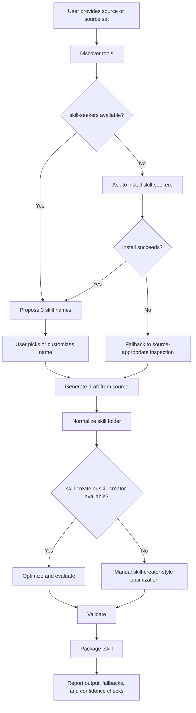

# Source Skill Pipeline

`source-skill-pipeline` 是一个用于把任意知识源转换成可靠 AI Skill 的工作流型 skill。

它的核心目标是把 `skill-seekers` 的资源分析与初稿生成能力，和 `skill-create` / `skill-creator` 的优化、评测、校验、打包流程串起来，形成一条可重复、可降级、可审查的技能生产流水线。

它不只适用于本地代码仓库。只要目标资源是 `skill-seekers` 支持或可以被人工解析的 source，都可以进入这条流水线。

## 适用场景

当你想把下面这些资源变成可安装、可复用的 Claude / Codex Skill 时，可以使用这个 skill：

- 本地代码仓库
- GitHub repository
- 文档网站
- PDF / Word / EPUB / PPTX
- OpenAPI / Swagger 规格
- Jupyter Notebook / HTML / AsciiDoc / man page
- RSS / Atom feed
- YouTube 或本地视频
- Confluence / Notion
- Slack / Discord 等 chat export
- 多个资源组合成的 unified source set

典型请求：

```text
把这个 GitHub repo 做成一个项目专属 skill。
```

```text
我有一个 OpenAPI 文件 specs/payments.yaml，帮我生成一个 API 使用 skill。
```

```text
把这套产品文档网站、GitHub 仓库和 Notion handbook 合起来做成一个团队 onboarding skill。
```

## 它解决的问题

从资源到 skill 通常会遇到几个问题：

- 资源类型很多，不能只按“本地代码目录”处理。
- 自动生成的 skill 往往过宽、过泛，触发不稳定。
- 生成结果需要校验：命令、API、流程必须来自真实 source evidence，不能猜。
- 不同电脑上的工具不一定完整安装；缺少 `skill-seekers` 时应先尝试安装，而不是直接放弃自动分析。
- skill 名称需要稳定、可安装、可发布。

`source-skill-pipeline` 把这些问题拆成几个明确阶段：

1. 发现当前环境可用工具。
2. 识别 source 类型与访问需求。
3. 给出 3 个推荐技能名，并允许用户自定义。
4. 如果缺少 `skill-seekers`，先执行安装流程。
5. 使用 `skill-seekers` 或 fallback 方式生成 draft skill。
6. 使用 `skill-create` / `skill-creator` 或手工流程优化 draft。
7. 校验 frontmatter、命名、证据引用和 eval prompts。
8. 打包成 `.skill` 文件。

## 工作流总览



## 命名规则

最终生成的 skill 名称分两步确定：

1. 先根据 source 标题、repo 名、URL、文件名、业务目标等生成 3 个推荐的 kebab-case 基础名。
2. 用户可以选择其中一个，也可以提供自定义名称。

最终目录名和 `SKILL.md` frontmatter 里的 `name` 必须统一为：

```text
<selected-name>-skill
```

如果用户选择的名称已经以 `-skill` 结尾，则不重复追加。

示例：

| 输入/选择 | 最终 skill name |
| --- | --- |
| `example-app` | `example-app-skill` |
| `Medtronic Portal` | `medtronic-portal-skill` |
| `Stripe OpenAPI` | `stripe-openapi-skill` |
| `team-handbook` | `team-handbook-skill` |
| `foo-skill` | `foo-skill` |

推荐的 3 个名称应覆盖不同角度：

- source 名称角度：如 `stripe-api`
- 工作流角度：如 `api-integration`
- 领域/受众角度：如 `payments-docs`

## 工具依赖策略

`skill-seekers` 是首选分析器。缺少它时，流程会先尝试安装，再决定是否 fallback。

`skill-create` 是优化加速器。缺少它时，不阻塞流程，可以使用 `skill-creator` 或手工优化。

| 可用工具 | 分析阶段 | 优化阶段 |
| --- | --- | --- |
| `skill-seekers` + `skill-create` | 使用 `skill-seekers` 生成 draft | 使用 `skill-create` 优化 |
| 只有 `skill-seekers` | 使用 `skill-seekers` 生成 draft | 使用 `skill-creator` 或手工优化 |
| 只有 `skill-create` | 先安装 `skill-seekers`；失败后手工分析 source | 使用 `skill-create` 优化 |
| 两者都没有 | 先安装 `skill-seekers`；失败后手工分析 source | 手工执行 skill-creator 风格优化 |

如果缺少 `skill-seekers`，skill 会提示先征得用户同意再安装。

如果安装方式不明确、需要网络、需要凭据，或者用户不想安装，流程不会中断，而是自动走 fallback。

### skill-seekers 安装流程

默认安装命令：

```bash
python3 -m pip install --user skill-seekers
```

如果你使用 `uv` 管理 CLI 工具，也可以选择：

```bash
uv tool install skill-seekers
```

如果 source 类型需要可选依赖，可以安装 extras：

```bash
python3 -m pip install --user 'skill-seekers[pptx]'
python3 -m pip install --user 'skill-seekers[video]'
python3 -m pip install --user 'skill-seekers[notion]'
python3 -m pip install --user 'skill-seekers[confluence]'
python3 -m pip install --user 'skill-seekers[rss]'
python3 -m pip install --user 'skill-seekers[chat]'
python3 -m pip install --user 'skill-seekers[all]'
```

安装后验证：

```bash
skill-seekers --version
skill-seekers --help
```

如果安装成功但命令不可用，通常需要把 Python user base 的 `bin` 目录加入 `PATH`。

## 支持的 source 类型

这个 skill 会以当前机器上的 `skill-seekers --help` 结果为准。常见支持命令包括：

| 命令 | 用途 |
| --- | --- |
| `create` | 从任意 source 自动检测并创建 skill |
| `analyze` | 分析本地代码仓库 |
| `github` | 抓取 GitHub repository |
| `scrape` | 抓取文档网站 |
| `pdf` | 从 PDF 提取知识 |
| `word` | 从 Word 文档提取知识 |
| `epub` | 从 EPUB 电子书提取知识 |
| `pptx` | 从 PowerPoint 提取知识 |
| `video` | 从 YouTube 或本地视频提取知识 |
| `openapi` | 从 OpenAPI / Swagger spec 提取 API 知识 |
| `html` | 从本地 HTML 文件提取知识 |
| `jupyter` | 从 Notebook 提取知识 |
| `asciidoc` | 从 AsciiDoc 提取知识 |
| `manpage` | 从 man page 提取知识 |
| `rss` | 从 RSS / Atom feed 提取知识 |
| `confluence` | 从 Confluence 提取知识 |
| `notion` | 从 Notion 页面提取知识 |
| `chat` | 从 Slack / Discord chat export 提取知识 |
| `unified` | 组合多个 source 类型 |

当 source 类型明确时，优先使用对应命令。

当 source 类型混合或不明确时，优先使用：

```bash
skill-seekers create <source> --name <selected-name>
```

或：

```bash
skill-seekers unified --config <multi-source-config>
```

实际命令参数以本机 `skill-seekers <command> --help` 为准。

## 安装

如果你已经有 `.skill` 包，可以直接安装到支持 skill 的 AI agent 环境中。

本仓库当前产物示例：

```text
dist/source-skill-pipeline.skill
```

如果从源码目录安装，请确保目录结构类似：

```text
source-skill-pipeline/
├── SKILL.md
├── README.md
├── references/
│   └── tool-adapters.md
├── scripts/
│   └── discover_skill_tools.py
└── evals/
    └── evals.json
```

其中：

- `SKILL.md` 是运行时主指令。
- `references/` 放较长的补充说明。
- `scripts/` 放可执行辅助脚本。
- `evals/` 放开发与评测用例，通常不需要打入最终 `.skill` 包。

## 使用示例

### 示例 1：本地代码仓库

```text
请使用 source-skill-pipeline，把当前目录这个项目做成一个 skill。
先给我 3 个推荐名称，我选一个后再继续。
```

预期行为：

- 探测 `skill-seekers` / `skill-create` 是否可用。
- 根据项目名称、package metadata、README 等给出 3 个推荐名。
- 用户选择后生成 `<selected-name>-skill`。
- 从 README、manifest、配置、测试、文档等提取 evidence。
- 生成、优化、校验、打包 skill。

### 示例 2：OpenAPI 文件

```text
把 ./specs/payments.yaml 做成一个 skill。
重点让之后的 agent 能快速理解认证、核心 endpoint、请求响应 schema 和常见集成流程。
```

预期行为：

- 识别 source 类型为 OpenAPI。
- 推荐如 `payments-api`、`api-integration`、`payments-docs` 这样的基础名。
- 使用 `skill-seekers openapi` 或 fallback 解析 spec。
- 生成包含 endpoint、auth、schema、示例和安全边界的 skill。

### 示例 3：多源资料

```text
把 docs 网站、GitHub repo 和 Notion handbook 合成一个 onboarding skill。
```

预期行为：

- 识别这是 mixed source set。
- 优先使用 `skill-seekers unified`。
- 如果缺少工具，则按 source 类型分别提取 evidence。
- 最终生成面向 onboarding 工作流的 source-specific skill。

## Fallback 行为

当 `skill-seekers` 不存在时，skill 会先执行安装流程。只有安装被拒绝、失败或当前环境无法安装时，才会按 source 类型采用最接近的手工分析方式：

- 代码仓库：读取 README、manifest、配置、入口、测试、文档。
- 文档/幻灯片：提取标题、章节、术语、流程、例子。
- 网站：在可访问时抓取或浏览相关页面，否则请求本地导出。
- OpenAPI：解析 endpoint、认证、schema、example、集成任务。
- chat export：识别反复出现的流程、决策、约定和支持模式。

当 `skill-create` 不存在时，skill 会按 `skill-creator` 风格手工优化：

- snapshot 原始 draft。
- 改进 `SKILL.md` 描述和指令。
- 增加 3 到 5 个真实 eval prompts。
- 检查 frontmatter 和命名。
- 尽可能执行 eval 或轻量人工审查。
- 打包最终 skill。

## 质量门槛

最终输出前，应该至少满足这些条件：

- `SKILL.md` 有合法 YAML frontmatter。
- `name` 是 kebab-case。
- 目录名和 frontmatter `name` 一致。
- 名称以 `-skill` 结尾，且不会出现 `-skill-skill`。
- 描述清楚说明何时触发。
- 命令、API、流程、事实来自真实 source evidence。
- 长内容放入 `references/`，避免 `SKILL.md` 过载。
- eval prompts 覆盖真实使用场景。
- 最终报告说明用了哪些工具、哪些 fallback、生成文件在哪里。

## 辅助脚本

### `scripts/discover_skill_tools.py`

用于发现当前机器上的可用工具和 `skill-seekers` 支持的命令。

运行：

```bash
python scripts/discover_skill_tools.py
```

输出示例：

```json
{
  "commands": {
    "skill-seekers": "/path/to/skill-seekers",
    "skill-create": null,
    "skill-creator": null,
    "claude": "/path/to/claude",
    "codex": "/path/to/codex"
  },
  "skill_seekers_supported_commands": [
    "create",
    "github",
    "scrape",
    "analyze",
    "pdf",
    "openapi",
    "notion",
    "chat"
  ],
  "recommended_path": "hybrid pipeline: skill-seekers draft, then skill-creator/manual optimization",
  "missing_optional_tools": [
    "skill-create"
  ]
}
```

这个脚本的意义是让 skill 不写死某个电脑上的工具状态，而是在运行时根据真实环境选择路径。

## 打包

如果你有 `skill-creator` 的打包脚本，可以使用：

```bash
python <skill-creator-path>/scripts/package_skill.py source-skill-pipeline dist
```

如果没有，也可以手工打包为 zip 格式的 `.skill` 文件。通常应排除根目录 `evals/`：

```bash
zip -r dist/source-skill-pipeline.skill source-skill-pipeline \
  -x 'source-skill-pipeline/evals/*' \
  -x '*/__pycache__/*' \
  -x '*.DS_Store'
```

## 开发与评测

`evals/evals.json` 用于记录开发阶段的测试提示和期望行为。

当前 evals 覆盖：

- 本地项目 source 到 skill 的完整流程。
- 非代码 source，例如 OpenAPI 文件。
- 已有 draft skill 的优化流程。
- 缺少 `skill-seekers` 或 `skill-create` 时的 fallback。
- 三个推荐名称和自定义命名规则。
- `-skill` 后缀规则。

这些 evals 主要用于维护者迭代 skill，不一定随最终安装包发布。

## 设计原则

### Source evidence first

不要让生成的 skill 凭空猜测命令、API 或流程。每条重要指令都应该能追溯到 source evidence。

### Tools are accelerators, not requirements

`skill-seekers` 是首选分析器，缺少时应该先尝试安装。`skill-create` 可以提高优化效率，但缺少它时不应该中断任务。fallback 是一等路径。

### Naming should be stable

最终 skill 名称必须稳定、可安装、可引用，并且和目录一致。

### Drafts are not truth

自动生成的 draft 只是起点。优化阶段必须审查、删减、校验和收敛。

### Keep runtime instructions lean

`SKILL.md` 应该保留高频、必要指令。长文档、source map、API 细节和命令表应放到 `references/`。

## License

请根据你的开源仓库策略补充许可证，例如 MIT、Apache-2.0 或其他许可证。
